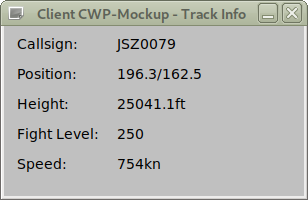
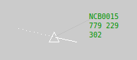

# CWP-Mockup

A mockup for an ATC controller working position (CWP). It can be used as a test dummy for different display setups.

<div style="float:left;">

</div>

This Mockup implements a server/client setup for a CWP in one single binary.

This binary is then started as a server and a client. Both, server and client, have simple frontends.

# Build the software

Ensure that you got [FLTK](https://www.fltk.org/) V1.3.5 development environment installed.
To prepare the build environment on Debian do:

```
apt -y install libfltk1.3-dev autoconf automake make g++
```

Enter the subdirectory `src/` and enter `./build.sh`. Add `--enable-static` to statically link the binary.

```
$ cd src
$ ./build.sh
```

If statically linked, the resulting binary should work fine in each linux environment without any special dependencies on the target host installed -- it just needs this single binary.

Start the binary with the option `-h` to see its usage:

```
$ ./CWPMockUp -h
Usage: ./CWPMockUp [options]
Options:
 -V
 --version
          print version number an exit
 -?
 --help
          show this help
 -s <name or IP address>
 --server <name or IP address>
          if this option is set, the CWP-Mockup will run in client mode and will connect the referenced server;
          this option is not passed, CWP-Mockup will run in server mode
 -p <port>
 --port <port>
          use <port> for the communication between server and client; default is 2566
 -d
 --debug
          enable debug mode and print some information
 -f
 --fullscreen
          when CWP-Mockup runs in client mode, open the main window fullscreen
```

# Server

## Starting the Server

Start the server without the command line argument `-s`. It will come up with its GUI and in parallel will listen for incoming connections on port 2566 by default. Use `-p` to change the port.

```
$ ./CWPMockUp
```

The GUI allows to change the number of simulated tracks (from 1 to 3000).

## What does the server do?
The server simulates the requested number of tracks. It uses an airspace of 500nm by 400nm with a maximum height of 40.000ft.

Each track position is initialized with a random position and height. Its speed is randomly set between 400 and 800kn. Its heading is also randomly set. The server also computes the predicted position of each track in 60 seconds.

Every 500ms all tracks are updated. Whenever a track reaches his headed position, or is about to leave the map, a new heading is set randomly.

The server transmitts all track data to a connected client every 1000ms.

# Client

## Starting the Client
Start the client with the command line argument `-s` and pass the servers hostname. By default it will connect to the server on port 2566 and will come up with its GUI.

```
$ ./CWPMockUp -s <hostname of the server>
```

The GUI allows to change the refresh rate on the display (from 10 to 5000ms).

## What does the client do?

The client receives incoming track data and will update its own track file. It will set history dots (every 10.000ms). On every received track update, an collision detection is done: when ever another track is closer than 10nm, it tagged.

The display is updated in the requested refresh rate. This update always updates all tracks including symbol, prediction, history dots, label and -- if set -- an collsion alarm.

## What does the label show?

The label is organized in three lines.

<div style="float:left;">

</div>

 1. callsign
 1. speed (in knots) and age (in ms)
 1. height (shown as flightlevel, which is height in feet / 100)
 
The age is the time between sending (not updating) the track from the server to the client, and the moment the track is drawn on the display. Whenever this time is equal or above 1.000ms the label is drawn in blue, instead of its standard color green.

The age gives a hint of the server and client processing speed respectivly load.

## What features are missing from the client?

This list is long, but here are the main aspects:

 - there are no maps displayed
 - no panning or zooming is implemented, instead the whole airspace map is scaled to fit into the display area
 - no track selection to operate on it

# Other aspects

## Why is FLTK used?

[FLTK](https://www.fltk.org/) is not that sophisticated, but it is fast and offers all we need for this project.

Furthermore, it allows to link the binary statically (see above), which not that easy with GTK+ or Qt.
