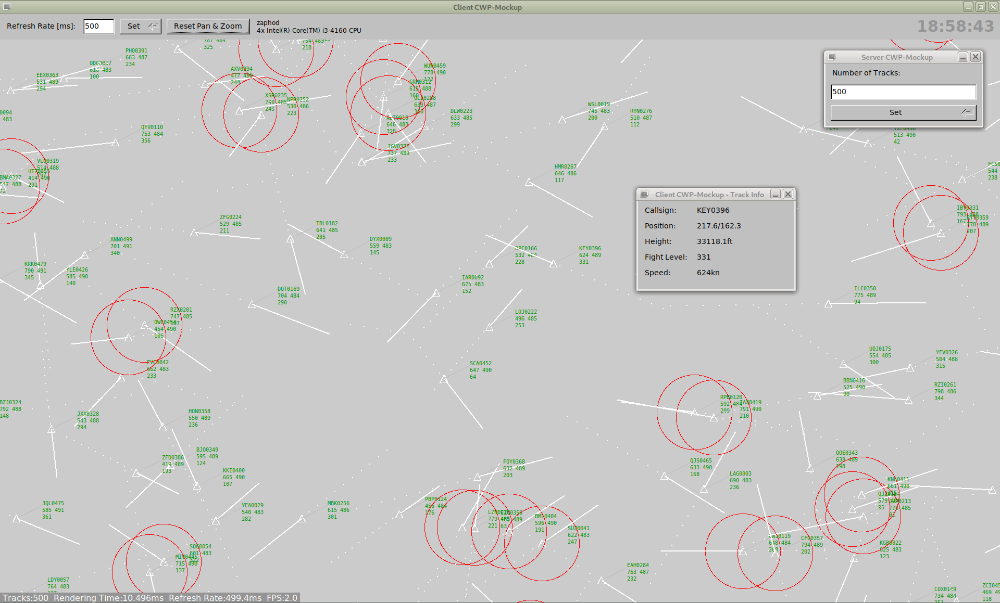
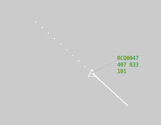

# CWP-Mockup

A mockup for an ATC controller working position (CWP). It can be used as a test dummy for different display or hardware setups.

It has no hardware dependency, no openGL/GLX. It can be used to test different paths between the server and the client and to measure the impact of bandwidth and latency.
Both, the X11 implementation and the web implementation have simple and effective implemented to reach good performance which is comparable.

<div style="float:left;">

</div>

This Mockup implements a server/client setup for a CWP in one single binary. In addition a standard and modern web browser can be used to display the web version.

This binary is then started as a server and a client. Both, server and client, have simple frontends.

# Build the software

Ensure that you got
[FLTK](https://www.fltk.org/) V1.3.5 and
[POCO C++ Libraries](https://pocoproject.org/)
development environment installed.
To prepare the build environment on Debian do:

```
apt -y install libfltk1.3-dev libpoco-dev autoconf automake make g++
```

Enter the subdirectory `src/` and enter `./build.sh`. Add `--enable-static` to statically link the binary.

```
$ cd src
$ ./build.sh
```

If statically linked, the resulting binary should work fine in each linux environment without any special dependencies on the target host installed -- it just needs this single binary.

Start the binary with the option `-h` to see its usage:

```
$ ./CWPMockUp -h
Usage: ./CWPMockUp [options]
Options:
 -V
 --version
          print version number an exit
 -?
 --help
          show this help
 -s <name or IP address>
 --server <name or IP address>
          if this option is set, the CWP-Mockup will run in client mode and
          will connect the referenced server;
          if this option is not passed, CWP-Mockup will run in server mode
 -p <port>
 --port <port>
          use <port> for the communication between server and client;
          default is 2566
 -d <dir>
 --docroot <dir>
          set the document root to serve static files via HTTP to deliver the web
          version of CWP-Mockup;
          default is /usr/share/CWP-Mockup/htdocs/
 -v
 --verbose
          enable debug mode and print some information
 -f
 --fullscreen
          when CWP-Mockup runs in client mode, open the main window fullscreen
```

# Server

## Starting the Server

Start the server without the command line argument `-s`. It will come up with its GUI and in parallel will listen for incoming connections on port 2566 by default. Use `-p` to change the port.

```
$ ./CWPMockUp
```

The server GUI allows to change the number of simulated tracks (from 1 to 3000).

## What does the server do?
The server simulates the requested number of tracks. It uses an airspace of 500nm by 400nm with a maximum height of 40,000ft.

Each track position is initialized with a random position and height. Its speed is randomly set between 400 and 800kn. Its heading is also randomly set. The server also computes the predicted position of each track in 60 seconds.

Every 500ms all tracks are updated. Whenever a track reaches his headed position, or is about to leave the map, a new heading is set randomly.

The server transmitts all track data to a connected client every 1000ms.

# Client

## Application Client (X11)

### Starting the Client
Start the client with the command line argument `-s` and pass the servers hostname. By default it will connect to the server on port 2566 and will come up with its GUI.

```
$ ./CWPMockUp -s <hostname of the server>
```

## Web Client

### Starting the Client
Start the client with the command line argument `-s` and pass the servers hostname. By default it will connect to the server on port 2566 and will come up with its GUI.

```
$ .chromium http://<hostname of the server>:2566/
```

The web GUI allows to change the refresh rate on the display (from 10 to 5000ms).
Furthermore, it supports zooming (via mouse wheel) and panning (via mouse dragging).


## What does the client do?

The client receives incoming track data via JSON and will update its own track file. It will set history dots (every 10s). On every received track update, an collision detection is done: when ever another track is closer than 10nm, it tagged.

The display is updated in the requested refresh rate. This update always updates all tracks including symbol, prediction, history dots, label and -- if set -- an collsion alarm.

The client allows panning by holding down the left mouse button, and zooming in and out with the mouse wheel.

Clicking on a track symbol within a range of 3nm will open an info window showing track details.

In the lower part of the display, the current performance values are displayed, which are:

 - number tracks the client processes,
 - the rendering time in milliseconds,
 - the refresh rate in milliseconds, as well as in frames per second (FPS).

## What does the label show?

The label is organized in three lines.

<div style="float:left;">

</div>

 1. callsign
 1. speed (in knots) and age (in ms)
 1. height (shown as flightlevel, which is height in feet / 100)
 
The age is the time between sending (not updating) the track from the server to the client, and the moment the track is drawn on the display. Whenever this time is equal or above 1000ms the label is drawn in blue, instead of its standard color green.

The age gives a hint of the server and client processing speed respectivly load.

## What features are missing from the client?

This list is long, but here are the main aspects:

 - there are no maps displayed

# Other aspects

## Performance

Server and client are both multi-hreaded

The server runs in the following threads:

 - socket communication to the client
 - air traffic generation
 - GUI

The server runs in the following threads:

 - socket communication to the server
 - air traffic processing
 - GUI

The following table gives an overview of the graphic thruput and performance of the CWP-MockUp on a low-cost system with an Intel Core i3 (4 cores @ 3.6GHz).

|# of Tracks|Refreshrate|FPS|CPU Load|bandwidth with X11 forwarding|
|----------------:|----------------:|---:|--------:|-----------------------------:|
||**[ms]**||**[%]**|**[MBits/s]**|
|250|10|100|<30|100|
|1500|50|20|<30|110|
|3000|100|10|<30|130|
|3000|500|2|<12|24|
|500|1000|1|<3|2.1|

In any of these test cases the full airspace was visible, so that in fact all tracks are drawn onto the display.
The limiting factor is the load of the X server, which doesn't run multi-threaded.
X11 Forwarding was done via a 1GBit/s LAN connection.

## Why is FLTK used?

[FLTK](https://www.fltk.org/) is not that sophisticated, but it is fast and offers all we need for this project.

Furthermore, it allows to link the binary statically (see above), which is not that easy with GTK+ or Qt.
